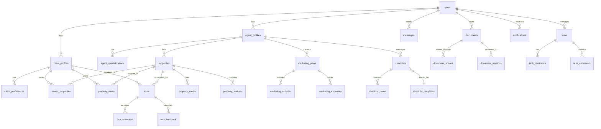
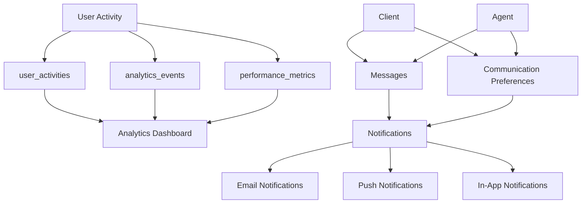
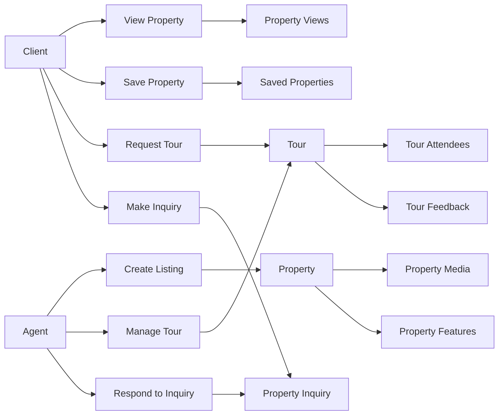

# Real Estate Application Database Structure

[Previous content remains the same until "User Workflows" section]

## Database Relationships

### Core Entity Relationships

### Analytics and Communication Flow

### Property and Tour Management Flow

## Key Relationships Explained

### User-Based Relationships
1. **User to Profiles**
   - One user can have either a client profile or an agent profile
   - Profiles contain role-specific information
   - Both profiles link back to the base user record

2. **User to Activities**
   - All user actions are tracked in user_activities
   - Analytics events are associated with users
   - Performance metrics are tracked per user

### Property-Based Relationships
1. **Property to Agent**
   - Each property must be associated with an agent
   - Agents can have multiple properties
   - Property features and media are linked to properties

2. **Property to Client Interactions**
   - Clients can view properties (tracked in property_views)
   - Clients can save properties (saved_properties)
   - Clients can make inquiries about properties

### Tour-Based Relationships
1. **Tour Connections**
   - Tours connect properties, clients, and agents
   - Tours can have multiple attendees
   - Tours can receive feedback
   - Tours status is tracked and managed

### Task-Based Relationships
1. **Task Management**
   - Tasks can be associated with any user type
   - Tasks can be related to various entities (properties, tours, etc.)
   - Tasks can have reminders and comments

### Document-Based Relationships
1. **Document Management**
   - Documents can be owned by any user type
   - Documents can be shared with multiple users
   - Documents can have multiple versions
   - Document access is controlled through shares

## Implementation Notes

### Database Constraints
1. **Foreign Key Constraints**
   - All FK relationships should be properly constrained
   - Use ON DELETE CASCADE where appropriate
   - Use ON DELETE RESTRICT to prevent orphaned records

2. **Unique Constraints**
   - Email addresses in users table
   - License numbers in agent_profiles
   - Property-client combinations in saved_properties

### Indexing Strategy
1. **Primary Indexes**
   - All PK fields are automatically indexed
   - All FK fields should be indexed

2. **Secondary Indexes**
   - Status fields for filtering
   - Date fields for sorting and filtering
   - Search fields (email, name, title)

3. **Composite Indexes**
   - (property_id, client_id) for property interactions
   - (sender_id, receiver_id) for messages
   - (user_id, created_at) for activities

### Performance Considerations
1. **Query Optimization**
   - Use appropriate indexes for common queries
   - Consider partitioning for large tables
   - Implement caching for frequent reads

2. **Data Distribution**
   - Shard based on user_id for large deployments
   - Consider read replicas for analytics
   - Cache frequently accessed data

[Previous sections on Best Practices, Scaling Considerations, and Maintenance Guidelines remain the same] 